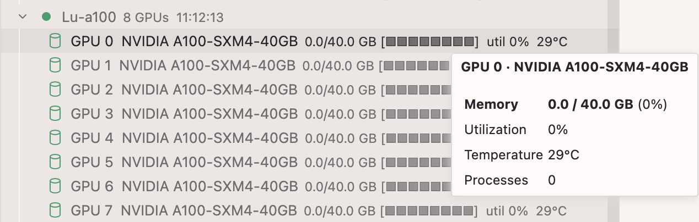

# GPU Monitor

A Cursor / VS Code extension that monitors NVIDIA GPU usage across your SSH servers, reading host configuration directly from `~/.ssh/config`.



## Features

- **Live GPU stats** — utilization %, VRAM usage (GB), temperature
- **Visual memory bar** — `[████████░░]` per GPU
- **Process list** — which processes are using each GPU (collapsed by default, click to expand)
- **Auto-sync** — reloads server list when `~/.ssh/config` changes
- **Password auth** — prompts once, stores securely in VS Code Secret Storage
- **Settings UI** — gear icon in panel header

## Requirements

- [Node.js](https://nodejs.org/) (for building)
- SSH servers running `nvidia-smi`
- SSH keys or passwords already configured in `~/.ssh/config`

## Installation

### macOS / Linux

```bash
git clone https://github.com/huia711/gpu-monitor
cd gpu-monitor
bash install.sh
```

Then restart Cursor / VS Code.

### Windows

```powershell
git clone https://github.com/huia711/gpu-monitor
cd gpu-monitor
.\install.ps1
```

> If PowerShell blocks the script: `Set-ExecutionPolicy -Scope CurrentUser RemoteSigned`

## Configuration

Click the **⚙ gear icon** in the GPU Monitor panel, or edit settings manually:

| Setting | Default | Description |
|---|---|---|
| `gpuMonitor.refreshInterval` | `30` | Auto-refresh interval (seconds) |
| `gpuMonitor.connectionTimeout` | `8` | SSH connection timeout (seconds) |
| `gpuMonitor.excludedServers` | `[]` | Host aliases to skip |
| `gpuMonitor.servers` | `[]` | Only monitor these hosts (empty = all) |

## Authentication

| Type | How it works |
|---|---|
| **SSH key** | Uses your system `ssh` command — ProxyJump, `ssh-agent`, etc. all work automatically |
| **Password** | Click the 🔑 key icon next to the server. Password is stored in VS Code Secret Storage and reused on subsequent refreshes. Right-click → *Clear Saved Password* to reset. |

## Updating

```bash
git pull
bash install.sh   # or .\install.ps1 on Windows
```

Then restart Cursor / VS Code.
